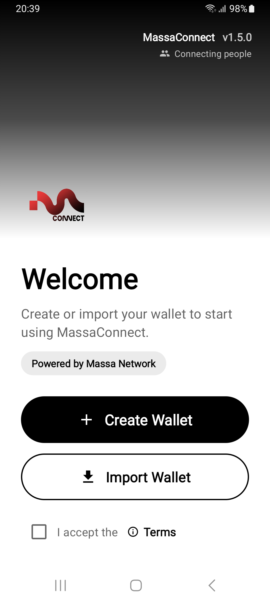
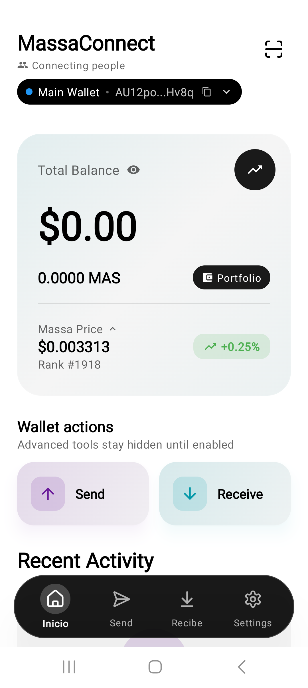
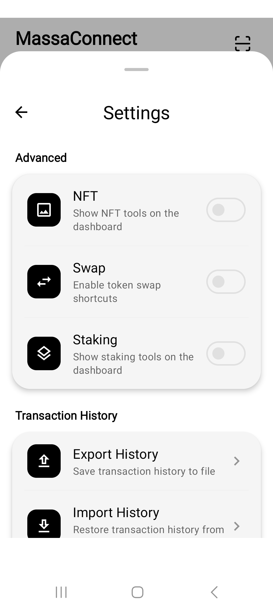
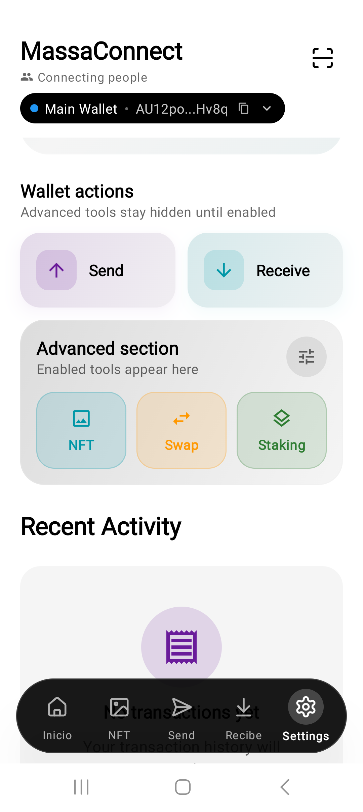
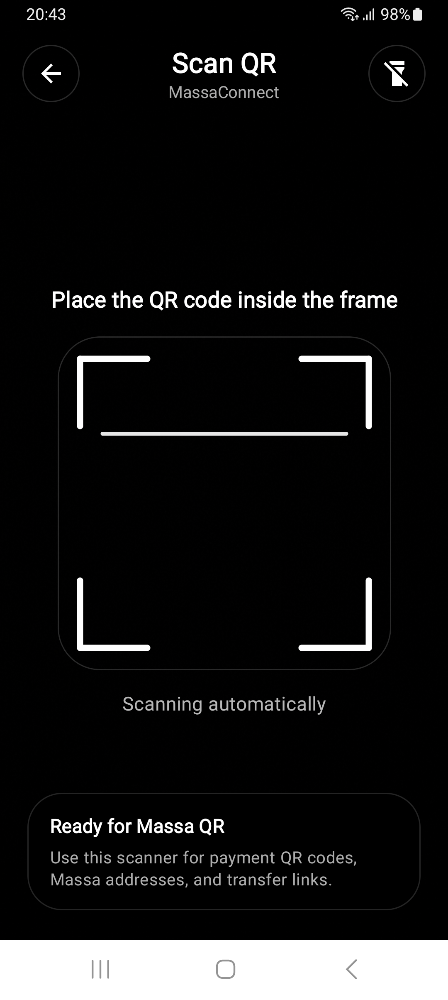
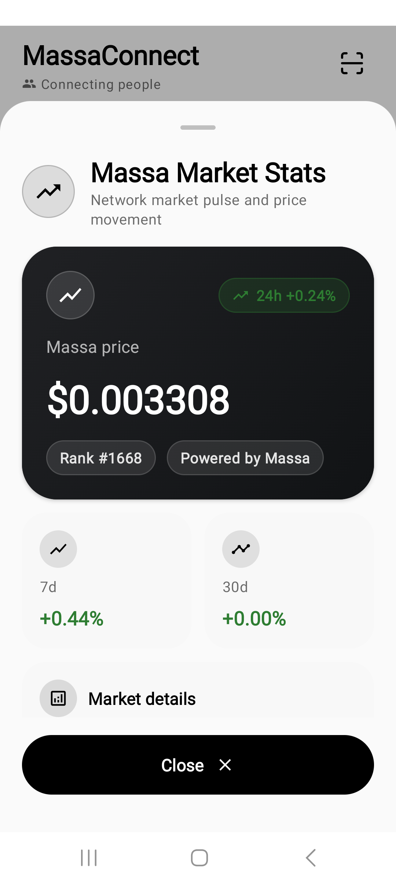
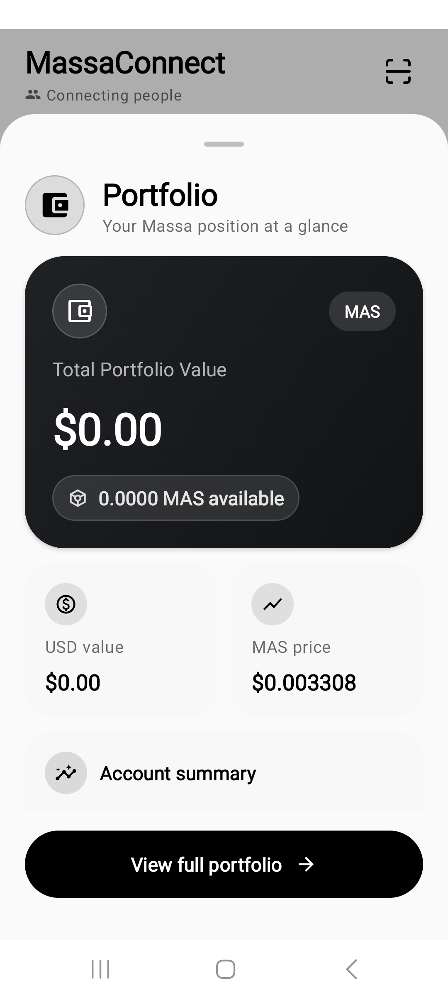
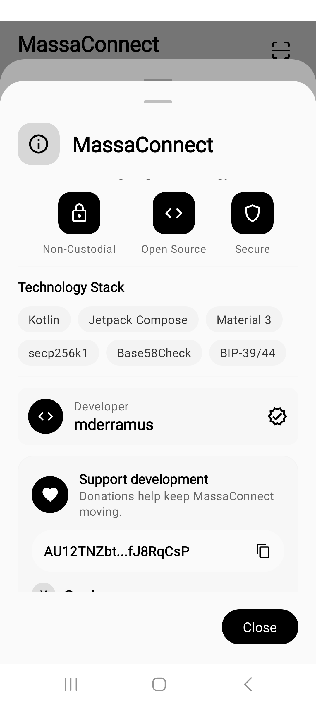
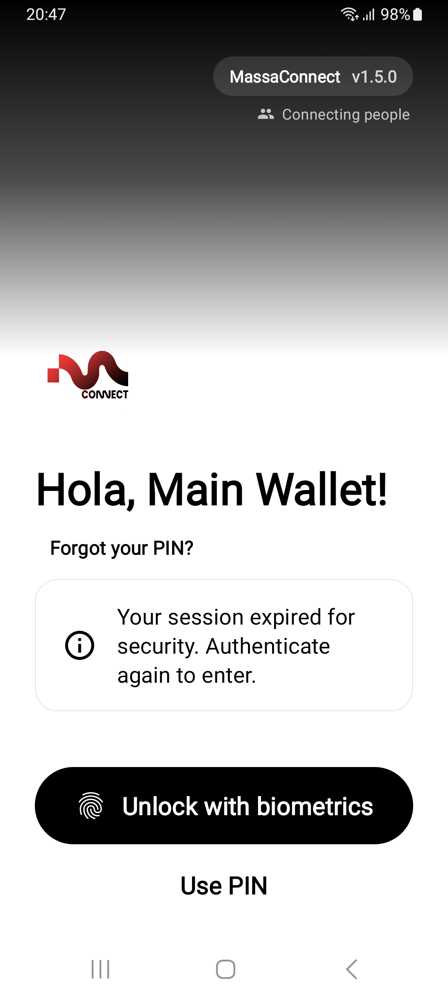
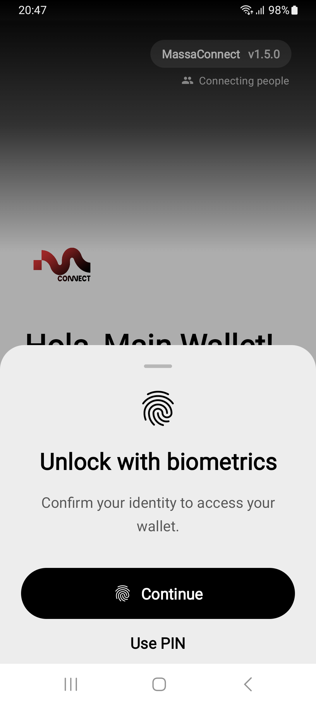

# MassaConnect

<div align="center">


**A self-custodial Android wallet for the Massa blockchain.**

[](LICENSE)
[](https://www.android.com/)
[](https://github.com/massaconnect/massaconnect/releases/tag/v1.5.0)

[Website](https://www.massaconnect.site/) | [Download APK](https://github.com/massaconnect/massaconnect/releases/download/v1.5.0/MassaConnect-v1.5.0.apk) | [Releases](https://github.com/massaconnect/massaconnect/releases) | [X/Twitter](https://x.com/massaconnect)

</div>

---

## What Is MassaConnect?

MassaConnect is a mobile wallet for Massa users who want direct control over their accounts, balances, tokens, NFTs, staking, swaps, and recovery phrase. It is self-custodial: private keys and recovery data stay on the user's Android device, protected by local encryption, PIN, and optional biometric unlock.

The app is built for day-to-day wallet use: create or recover a wallet, manage multiple accounts, send and receive MAS, scan QR codes, review recent activity, view portfolio data, use optional advanced sections, and interact with Massa ecosystem tools.

---

## Latest Version

**MassaConnect 1.5.0** is a major UX and wallet-flow update.

- New splash, welcome, onboarding, unlock, and dashboard experience.
- Material Design 3 modal bottom sheets across onboarding, authentication, settings, send, swap, portfolio, market stats, and transaction results.
- Redesigned dashboard with wallet identity, glass-style bottom navigation, portfolio preview, and Massa market stats.
- Optional advanced features for NFT, Swap, and Staking.
- Improved selected-wallet handling across balance and send flows.
- Background balance monitoring and received-balance notifications.
- Updated send, swap, QR scanner, recovery phrase, and result screens.

Download the signed release APK:

```text
https://github.com/massaconnect/massaconnect/releases/download/v1.5.0/MassaConnect-v1.5.0.apk
```

---

## Screenshots

<p align="center">
  
  
  
  
  
</p>

<p align="center">
  
  
  
  
  
</p>

---

## Features

- Self-custodial Massa wallet with local key storage.
- Wallet creation and recovery phrase import.
- Multiple wallet/account support with active-wallet selection.
- MAS balance, USD value, and recent activity.
- Send and receive MAS with QR scanner support.
- Optional biometric unlock and PIN fallback.
- Portfolio view for Massa assets.
- Swap flow with confirmation and result screens.
- NFT gallery and staking sections available through Advanced Section toggles.
- Massa market statistics.
- Dark and light themes.
- Received-balance monitoring and local notifications.
- Open-source Android codebase.

---

## Technology Stack

| Area | Technology |
| --- | --- |
| Language | Kotlin |
| Platform | Android, minSdk 26, targetSdk 34, compileSdk 35 |
| UI | Jetpack Compose, Material Design 3 |
| Architecture | Modular Android project, MVVM-style ViewModels |
| Dependency Injection | Hilt |
| Navigation | AndroidX Navigation Compose |
| Networking | Retrofit, OkHttp, Gson |
| Local Storage | DataStore, Room, EncryptedSharedPreferences |
| Security | Android Keystore, AndroidX Security Crypto, AES-256-GCM |
| Authentication | AndroidX Biometric, PIN unlock |
| Background Work | WorkManager |
| Blockchain Crypto | Ed25519, BLAKE3, Massa address/key handling |
| Build | Gradle, Android Gradle Plugin, JDK 17 |

---

## Project Structure

```text
massaconnect/
├── app/        # Android application entry point and release config
├── core/       # Shared models, preferences, and core utilities
├── network/    # Massa API repositories and network models
├── security/   # Wallet, account, key, biometric, and secure storage logic
├── ui/         # Compose screens, components, and ViewModels
└── price/      # Price and market data support
```

---

## Build From Source

### Requirements

- Android Studio
- JDK 17
- Android SDK 35
- Gradle through the included wrapper

### Debug Build

```bash
git clone https://github.com/massaconnect/massaconnect.git
cd massaconnect
./gradlew assembleDebug
```

The debug APK is generated at:

```text
app/build/outputs/apk/debug/app-debug.apk
```

### Release Build

Release signing uses local keystore properties and private signing files that are intentionally not committed to the repository.

```bash
./gradlew assembleRelease
```

---

## Official Links

- Website: https://www.massaconnect.site/
- App repository: https://github.com/massaconnect/massaconnect
- Website repository: https://github.com/massaconnect/massaconnect-website
- Releases: https://github.com/massaconnect/massaconnect/releases
- Issues: https://github.com/massaconnect/massaconnect/issues
- X/Twitter: https://x.com/massaconnect

---

## Security Notice

MassaConnect is self-custodial. The user is responsible for safely backing up the recovery phrase and keeping private keys, PINs, and biometric access secure. If the recovery phrase is lost, the wallet cannot be recovered by the project maintainers.

For this 1.5.0 APK, a new release signing key is used because the previous local signing key was no longer available. Android may require uninstalling older builds signed with a different key before installing this version. Back up the recovery phrase before uninstalling any wallet app.

---

## License

This project is licensed under the MIT License. See [LICENSE](LICENSE) for details.
